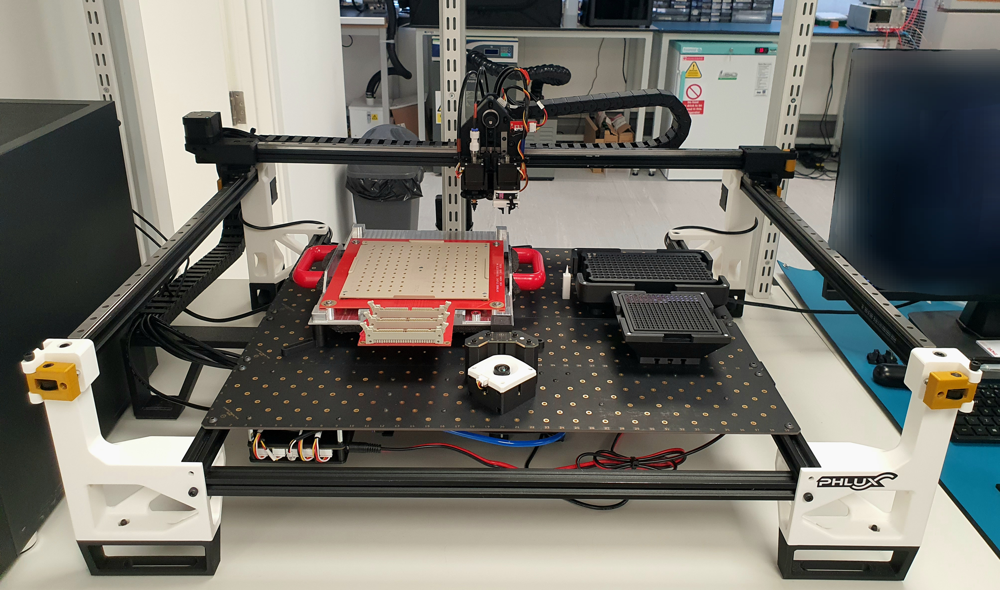
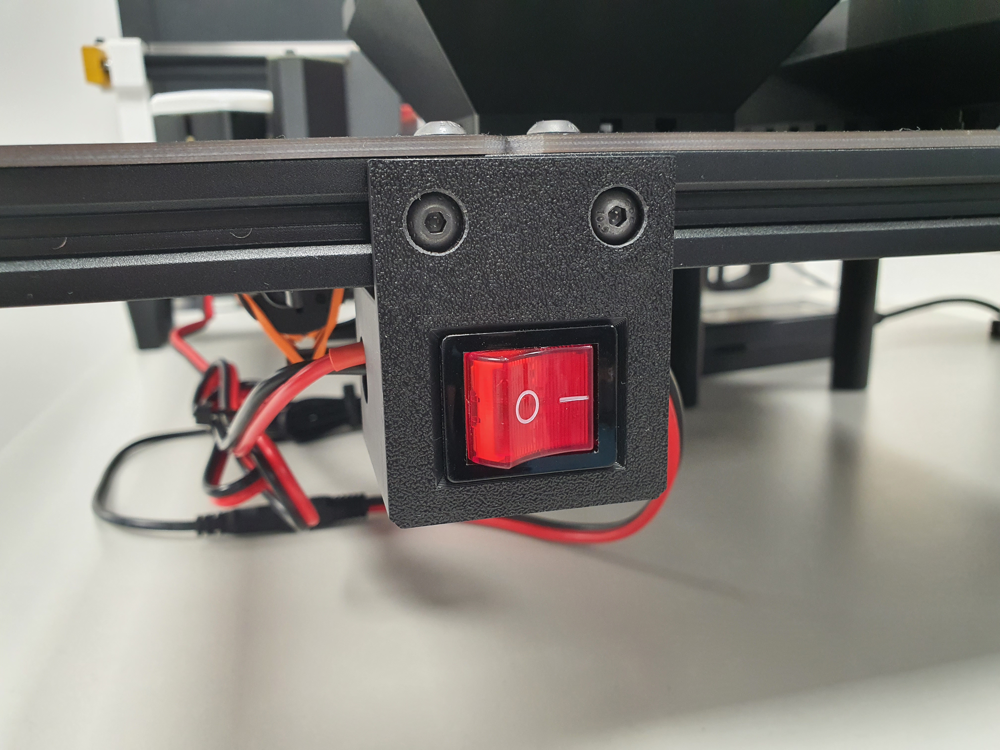
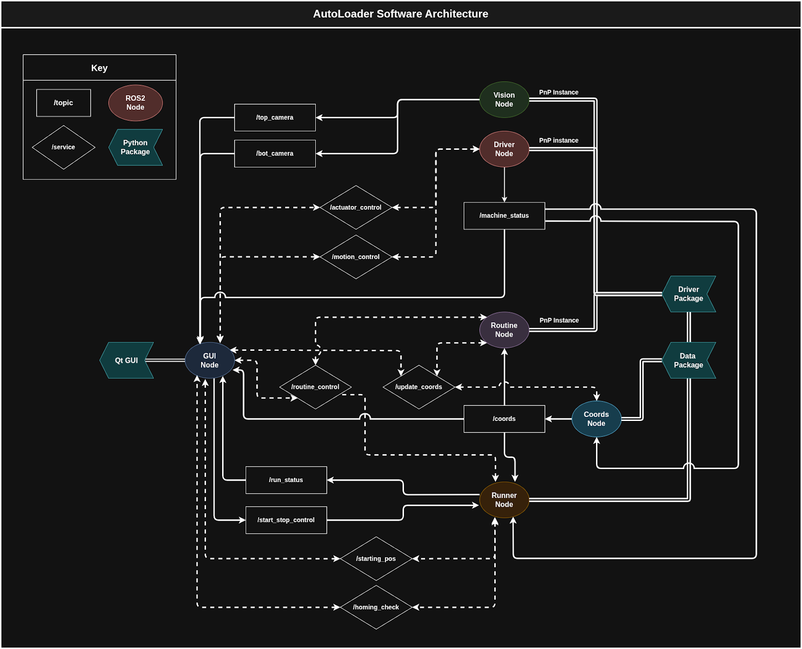
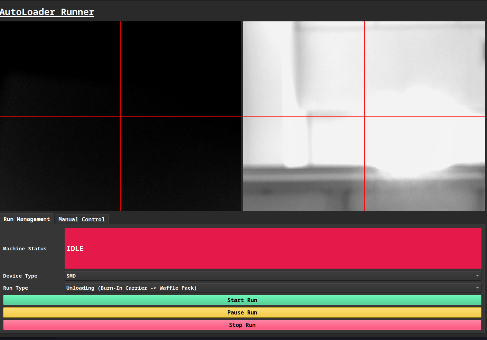
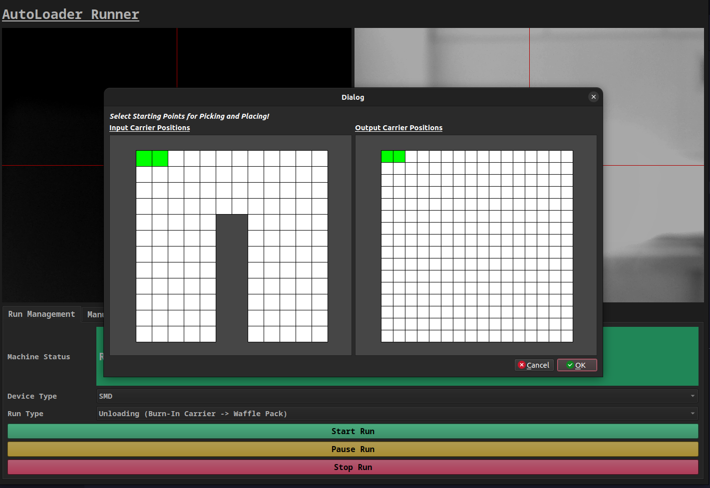

# AutoLoader – A Custom LumenPnP

## About the Project

The AutoLoader is a high-precision, custom pick-and-place machine designed to automate the loading and unloading of both SMD and THT devices between various carriers.

Built upon the open-source [Opulo](https://www.opulo.io/) LumenPnP V3.2.2, this machine was developed during my year-long placement as a Robotics & Automation Intern at [Phlux Technology](https://phluxtechnology.com/).

This repository is intended as a **reference** for developers looking to modify or extend the LumenPnP for specialised applications.

---

## Hardware Modifications

To meet the unique demands of Phlux’s production workflow, the AutoLoader required substantial hardware modifications from the base LumenPnP:

### Expanded Work Area
- Replaced stock legs with [AlanaCat's Wide Body legs](https://grabcad.com/library/lumenpnp-wide-body-mod-1), modified for increased vertical clearance (to accommodate tall device carriers).
- Extended the X-axis with longer extrusions and linear rails to maximize both X and Y travel in the new wide-body frame.

### Custom Gripper End-Effector

- Developed a micro-servo mechanical gripper, inspired by the [Annin Robotics AR4](https://anninrobotics.com/post/new-servo-gripper-for-the-ar4/), for handling TO-46 (THT) devices not suited to vacuum-based picking.

### Custom Mounts
- Designed and 3D-printed mounts for device carriers and waffle packs, enabling secure and modular attachment to the staging plates.
  
- Redesigned the bottom camera mount, relocating the camera and lighting above the staging plate to resolve focus issues from increased machine height.
  

### Quality of Life Improvements
- Replaced the original drag chain system with separate X and Y drag chains (inspired by LumenPnP V4) for better cable management and reliability.
- Added a dedicated power switch for easier power cycling.
  

---

## Software Modifications

### Control API
Located in `autoloader_controller/autoloader_controller/src/`, the custom control API includes:
- Advanced Motion Control (w/ Runout & Backlash Compensation)
- Absolute & Relative Position Tracking
- Device Offset & Orientation Detection
- Modular Actuator Control (e.g., my custom gripper attachment)

### ROS2 Integration
Custom ROS2 packages and nodes were developed to handle high-level functionality:
- System State Management  
- Homing (Both Mechanical & Visual) & Idle Routines  
- Picking & Placing Routines  
- Offset & Orientation Correction (Devices + Fiducials / Markers)  
- Carrier Skew Correction  
- Landmark (Carriers, Fiducials, Devices) Coordinate Tracking  
- Running the GUI

### GUI
User-friendly GUI built with PySide6 that allows for both manual control and loading/unloading run management.

---

## Contact

**William Nathanael Santoso**  
Robotics & Automation Intern, Phlux Technology  
BEng Mechatronic & Robotic Engineering, University of Sheffield

Email: will.nat.santoso@gmail.com
GitHub: [@willnatsan](https://github.com/willnatsan/)
LinkedIn: [William Santoso](https://www.linkedin.com/in/williamnsantoso/)

---

## Acknowledgements

The AutoLoader project wouldn't have been possible without the continued support from:
- [Opulo](https://www.opulo.io/)
- [Phlux Technology](https://phluxtechnology.com/)
- [University of Sheffield](https://sheffield.ac.uk/)
